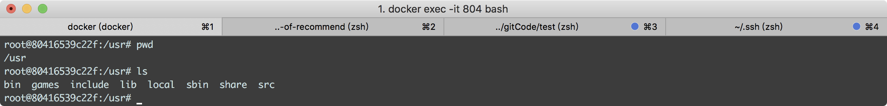
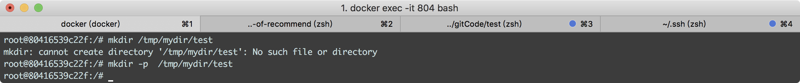
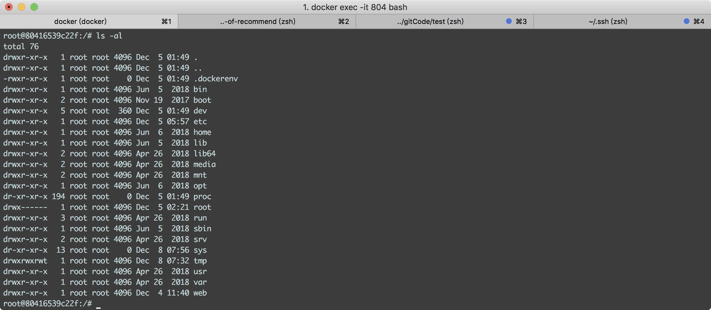

### 系统目录结构样例

当我们登录我们的系统后，你可以进入系统的根目录，输入 `cd /` ,然后在当前命令窗口下输入命令 `ls` ,你就会看到如下所示：


树状目录结构：


### 目录清单以及解释

* `/bin` bin是Binary的缩写，这个目录存放着经常使用的命令（二进制可执行命令）。

  > / bin目录包含在单用户模式下安装系统时必须存在的基本用户二进制文件（程序）。诸如Firefox之类的应用程序存储在`/usr/bin`中，而重要的系统程序和实用程序（例如bash shell）则位于`/bin`中。`/usr`目录可以存储在另一个分区上-将这些文件放在`/bin`目录中可确保即使没有安装其他文件系统，系统也将具有这些重要的实用程序。`/sbin`目录类似–它包含基本的系统管理二进制文件。

* `/boot` 这里存放的是启动Linux时使用的一些核心文件，包括一些连接文件以及镜像文件（静态启动文件）。
  > `/boot`目录包含引导系统所需的文件，例如，GRUB引导加载程序的文件和Linux内核存储在此处。但是，引导加载程序的配置文件不在此处–它们与其他配置文件位于`/etc`中。

* `/dev` dev是Device(设备)的缩写, 该目录下存放的是Linux的外部设备，在Linux中访问设备的方式和访问文件的方式是相同的（设备文件）。
  
  > Linux将设备公开为文件，`/dev`目录包含许多代表设备的特殊文件。这些不是我们所知道的实际文件，而是显示为文件–例如，`/dev/sda`表示系统中的第一个SATA驱动器。如果要对其进行分区，可以启动分区编辑器，并告诉它编辑`/dev/sda`。

* `/etc` 这个目录用来存放所有的系统管理所需要的配置文件和子目录（配置文件）。
  
  > `/etc`目录包含配置文件，通常可以在文本编辑器中手动对其进行编辑。请注意，/ etc /目录包含系统范围的配置文件–特定于用户的配置文件位于每个用户的主目录中

* `/home` 用户的主目录，在Linux中，每个用户都有一个自己的目录，一般该目录名是以用户的账号命名的（主文件夹）。
  
  > `/home`目录包含每个用户的主文件夹。例如，如果您的用户名为bob，则您的主文件夹位于`/home/bob`。此主文件夹包含用户的数据文件和用户特定的配置文件。每个用户仅对其自己的主文件夹具有写访问权，并且必须获得提升的权限（成为root用户）才能修改系统上的其他文件。

* `/lib` 这个目录里存放着系统最基本的动态连接共享库，其作用类似于Windows里的DLL文件。几乎所有的应用程序都需要用到这些共享库（基本共享库）。
  
  > `/lib`目录包含`/bin`和`/sbin`文件夹中的基本二进制文件所需的库。`/usr/bin`文件夹中的二进制文件所需的库位于/ usr / lib中。

* `/media` linux系统会自动识别一些设备，例如U盘、光驱等等，当识别后，linux会把识别的设备挂载到这个目录下（可移动媒体）。
  
  > `/media`目录包含安装在计算机中的可移动介质设备所在的子目录。例如，当您将CD插入Linux系统时，将在/ media目录中自动创建一个目录。您可以在此目录中访问CD的内容。

* `/mnt` 系统提供该目录是为了让用户临时挂载别的文件系统的（临时挂载点）。
  
  > 从历史上看，`/mnt`目录是系统管理员在使用它们时挂载临时文件系统的位置。例如，如果要安装Windows分区以执行一些文件恢复操作，则可以将其安装在`/mnt/windows`。但是，您可以在系统上的任何位置挂载其他文件系统。

* `/opt` 这是给主机额外安装软件所摆放的目录（可选软件包）。
  
  > `/opt`目录包含可选软件包的子目录。不符合标准文件系统层次结构的专有软件通常使用它-例如，专有程序在安装时可能会将其文件转储到`/opt/application中`。
`/proc` 这个目录是一个虚拟的目录，它是系统内存的映射（内核和进程文件）。

  > `/proc`目录类似于`/dev`目录，因为它不包含标准文件。它包含代表系统和过程信息的特殊文件。

* `/root` 该目录为系统管理员，也称作超级权限者的用户主目录（根主目录）。

  > `/root`目录是root用户的主目录。它不是位于`/home/root`，而是位于`/root`。这不同于/，后者是系统根目录。

* `/run` 是一个临时文件系统，存储系统启动以来的信息（应用程序状态文件）。

  > `/run`目录是一个相当新的目录，它为应用程序提供了一个标准位置来存储所需的临时文件，例如套接字和进程ID。这些文件无法存储在`/tmp`中，因为/ tmp中的文件可能已删除。

* `/sbin` s就是Super User的意思，这里存放的是系统管理员使用的系统管理程序（系统管理二进制文件）。

  > `/sbin`目录类似于`/bin`目录。它包含基本二进制文件，这些二进制文件通常由root用户运行以进行系统管理。

* `/srv` 该目录存放一些服务启动之后需要提取的数据（服务数据）。

  > `/srv`目录包含“系统提供的服务数据”。如果您使用Apache HTTP服务器为网站提供服务，则可能会将网站的文件存储在`/srv`目录中的目录中。

* `/sys` 该文件系统是内核设备树的一个直观反映（统一设备模型）。

  > 这是linux2.6内核的一个很大的变化。该目录下安装了2.6内核中新出现的一个文件系统sysfs。sysfs文件系统集成了下面3种文件系统的信息：针对进程信息的proc文件系统、针对设备的devfs文件系统以及针对伪终端的devpts文件系统。

* `/tmp` 这个目录是用来存放一些临时文件的（临时文件）。

  > 应用程序将临时文件存储在`/tmp`目录中。通常，每当系统重新启动时，这些文件都会被删除，并且tmpwatch等实用程序可能会随时删除这些文件。

* `/var` 这个目录中存放着在不断扩充着的东西，我们习惯将那些经常被修改的目录放在这个目录下。包括各种日志文件（可变数据文件）。

  > `/var`目录是`/usr`目录的可写副本，`/usr`目录在正常操作中必须为只读。日志文件以及在正常操作期间通常会写入`/usr`的所有其他内容都写入`/var`目录。例如，您将在`/var/log`中找到日志文件。

* `/usr` 用户的很多应用程序和文件都放在这个目录下（用户二进制文件和只读数据）。

  > `/usr`目录包含用户使用的应用程序和文件，而不是系统使用的应用程序和文件。例如，非必需应用程序位于`/usr/bin`目录中，而不是`/bin`目录中；非必需系统管理二进制文件位于`/usr/sbin`目录中，而不是`/sbin`目录中。每个库都位于`/usr/lib`目录中。`/usr`目录还包含其他目录–例如，与体系结构无关的文件（例如下图）位于`/usr/share`中。
  默认情况下，/ usr / local目录是本地编译的应用程序安装到的目录–这样可以防止它们破坏系统的其余部分
  
* `/usr/bin` 系统用户使用的应用程序（其它的可执行命令）。
* `/usr/sbin` 超级用户使用的比较高级的管理程序和系统守护程序。

### 文件目录管理知识

#### 创建目录
目录是您要创建的目录的绝对或相对路径名

现在，我们将了解如何创建相对路径目录。
```
mkdir dirname
```
创建绝对路径目录
```
mkdir /tmp/test-dir
```
如果在命令行上提供多个目录，则mkdir将创建每个目录
```
mkdir docs public
```

#### 创建父目录
现在，我们将了解如何创建父目录。有时，当您要创建目录时，其父目录或目录可能不存在。在这种情况下，mkdir发出如下错误消息



如上图所示，在这种情况下，可以为mkdir命令指定-p选项。它会为您创建所有必需的目录
```
mkdir -p /tmp/mydir/test
```

### 删除目录
要删除目录，请确保其为空，这意味着该目录内不应有任何文件或子目录

可以使用rmdir命令删除目录，如下所示
```
rmdir dirname
```
想必已经有同学想到删除多个目录的方法
```
rmdir dirname1 dirname2 dirname3
// 如果目录dirname1，dirname2和dirname3为空，则上面的命令将其删除。该命令rmdir命令不产生任何输出，如果它是成功的
```

#### 更改进入的目录
您可以使用cd命令执行更多操作，而不仅仅是更改到主目录。您可以通过指定有效的绝对或相对路径来使用它来更改任何目录
```
// 使用相对路径
cd dirname

// 使用绝对路径
cd /usr/local/bin
```

#### 重命名目录
MV（移动）指令，也可用于重命名的目录
```
mv olddir newdir
```

### 其它内容

#### 目录 . 和 .. 的区别
`.`表示当前工作目录;`..`表示当前工作目录的上级目录,通常被称为父目录。
#### 查看当前文件目录下的 文件或目录
可以使用`ls`查看当前目录下的 工作目录/文件的列表，使用-a选项可以列出所有文件，使用-l查看详细信息。



### 参考资料
[《The Linux Directory Structure, Explained》](https://www.howtogeek.com/117435/htg-explains-the-linux-directory-structure-explained/)

[《Unix / Linux-目录管理》](https://www.tutorialspoint.com/unix/unix-directories.htm)

