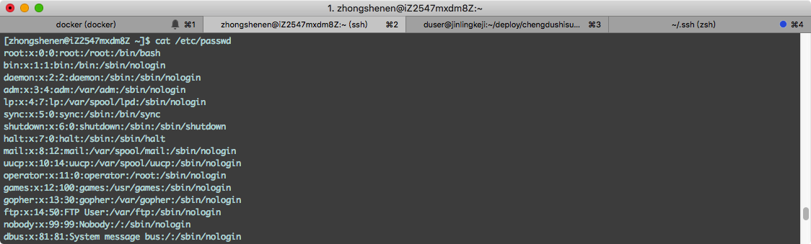
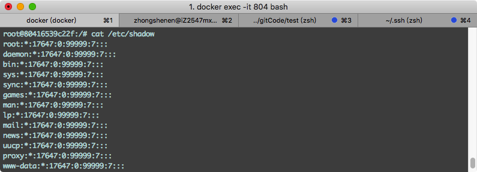
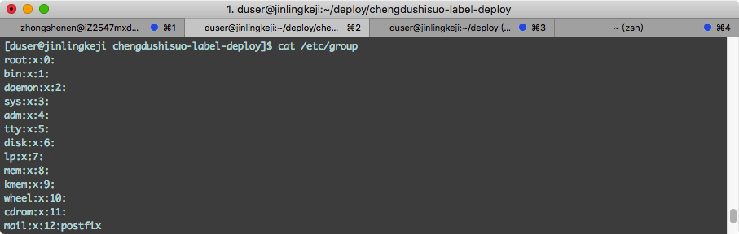
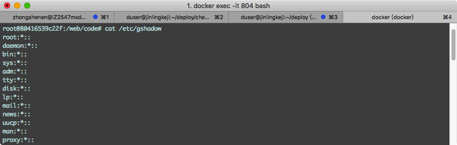

### 用户信息存储文件

#### 1.`/etc/passwd`存储当前系统中所有用户的信息

文件的内容格式

 root  |     x      |   0    |    0     |     root     |   /root    | /bin/bash
:-----:|:----------:|:------:|:--------:|:------------:|:----------:|:--------:
用户名 | 密码占位符 | 用户ID | 用户组ID | 用户注释信息 | 用户家目录 | shell类型

> 各信息之间以`:`分割

示例：



#### 2.`/etc/shadow`存储当前系统中所有用户的密码信息

文件的内容格式

 root  |     $123     |      17647       |      0       |   99999    |    7     |      ...
:-----:|:------------:|:----------------:|:------------:|:----------:|:--------:|:--------:
用户名 | 密码（加密后） | 最后一次修改时间 | 最小时间间隔 | 密码有效期 | 警告时间 | 不重要，省略...

> 信息之间以`:`分割
> 密码字段存放的是加密后的用户密码

示例：




### 用户组信息存储文件

#### 1`/etc/group`存储当前系统中所有用户组的信息

文件的内容格式

  root   |      x       |    0     | veewee,vagrant
:-------:|:------------:|:--------:|:-------------:
用户组名 | 组密码占位符 | 用户组ID |  组内用户列表

> 信息之间以`:`分隔
> "组内用户列表" 是属于这个组的所有用户的列表，不同用户之间用逗号(,)分隔。这个用户组可能是用户的主组，也可能是附加组。

示例：



#### 1`/etc/gshadow`存储当前系统中所有用户组的密码信息

文件的内容格式

  root   |        |    0     | veewee,vagrant
:-------:|:------:|:--------:|:-------------:
用户组名 | 组密码 | 组管理者 |  组内用户列表

> 信息之间以`:`分隔
> "组密码" 为空或 ! 时，表示用户组没有密码

示例：



### 目录/文件权限

之前说过Linux是一个等级森严的系统，一个文件或者目录对于不同的用户有不同的权限
。
权限分为三部分，每组中的每个位置代表一个特定的权限，顺序为：读取（r），写入（w），执行（x）。
```
文件：
    r: 可获取文件的数据；
    w: 可修改文件的数据；
    x: 可将文件运行为进程；
目录：
    r: 可使用ls命令获取其下的所有文件列表(不包括详细信息)
    w: 可修改此目录下的文件列表；即创建或删除文件；
    x: 可cd到此目录中，且可使用ls -l来获取所有文件的详细属性信息；
    一个文件或者目录的权限主要是对于该文件或目录的属主、属组以及其他用户来说，利用ls -l可以查看一个文件对于属主、属组和其他用户的权限
```

* 前三个字符(2-4)代表文件所有者的权限。例如，-rwxr-xr--表示所有者具有读(r)，写(w)和执行(x)权限。
* 第二组三个字符(5-7)包含文件所属组的权限。例如，-rwxr-xr--表示该组具有读取(r)和执行(x)权限，但没有写权限。
* 最后一组三个字符(8-10)代表其他所有人的权限。例如，-rwxr-xr--表示存在只读(r)权限。